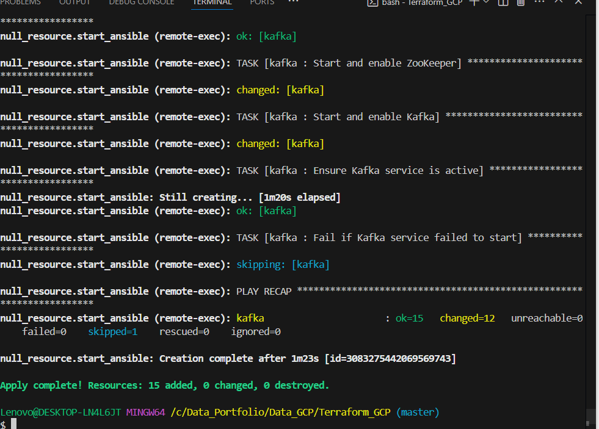
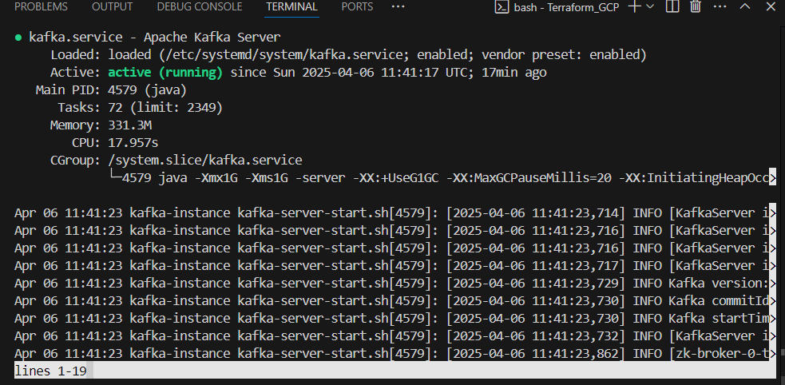
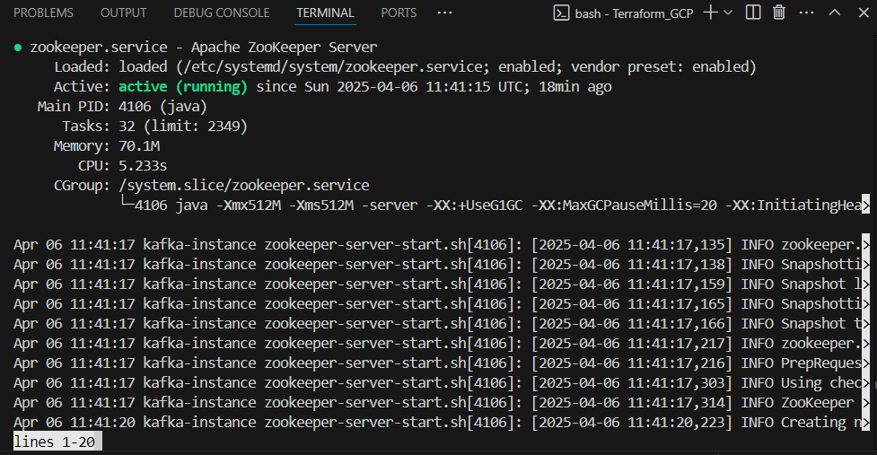

# Kafka Spark BigQuery NewsStream
==========================

A real-time news processing pipeline using Apache Kafka, Apache Spark, and Google BigQuery.

## Overview
-----------

This project demonstrates a scalable and fault-tolerant architecture for processing news articles in real-time. The pipeline collects news articles from various sources, processes them using Apache Spark, and stores the results in Google BigQuery for analysis.

## Architecture
------------

The pipeline consists of the following components:

1. **Kafka**: Collects news articles from various sources and stores them in a Kafka topic.
2. **Spark**: Processes the news articles collected from Kafka, performing tasks such as data cleaning, tokenization, and sentiment analysis.
3. **BigQuery**: Stores the processed data for analysis and querying.

## Requirements
------------

* **Kafka**: Apache Kafka 3.0 or later
* **Spark**: Apache Spark 3.2 or later
* **BigQuery**: Google BigQuery
* **Python**: Python 3.8 or later
* **Java**: Java 11 or later

# Terraform and Ansible

This projects deploys Apache Kafka on Google Cloud Platform (GCP) using Terraform for instance creation & provision, Ansible for Spark, Kafka & Zookeeper, Python, pip and modules installation. Ansible files in the form of Terraform templates are rendered dynamically and provisioned to VMs. A new VPC is created, with a public subnet for control VM and a private subnet with a NAT Gateway for Kafka VM, Python producer VM and Spark Consumer VM.

## Directory Structure

- `Terraform_GCP/`: Contains .tf scripts for instance creation.
- `ansible_files/`: Ansible files for Kafka & Zookeeper installation on VM.

## Getting Started

To deploy Kafka on GCP:

1. **Set Up GCP Environment**: Ensure you have a GCP account and the necessary permissions to create and manage resources. Create a key and download .json file.

2. **Provision Virtual Machines**: Create VM instances that will serve as Kafka brokers and Zookeeper nodes (handled by Terraform).

3. **Install Kafka and Zookeeper**: On Kafka VM, install the required software packages using Ansible (started upon creation and provision of VMs by Terraform with remote-exec). 

   

5. **Configure Networking**: Set up appropriate firewall rules and networking configurations to allow communication between nodes.

6. **Start Services**: Initiate Zookeeper and then start the Kafka brokers, defined as Ansible tasks.

   

   

## License

This project is licensed under the MIT License. See the `LICENSE` file for details.
